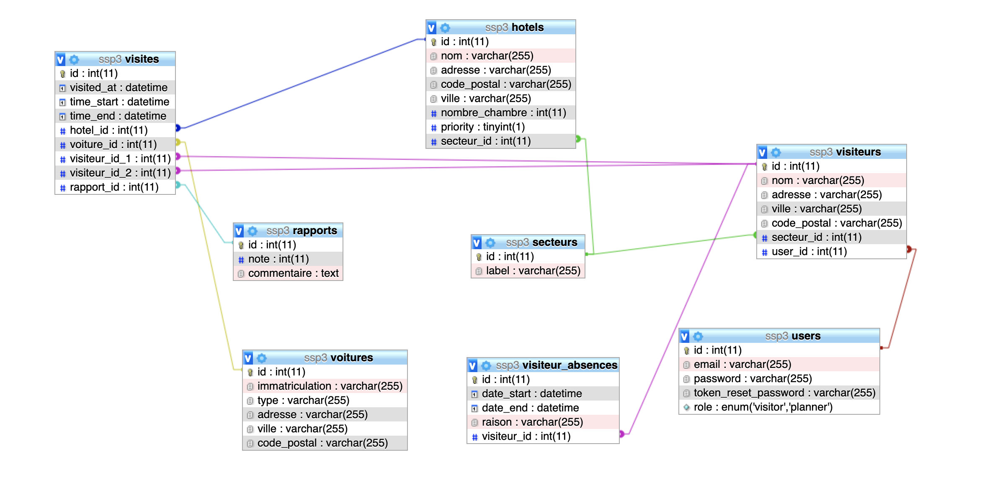

# [GR3] SAMU SOCIAL DE PARIS - Partie Back

👋🏼Bonjour et bienvenue sur le Readme de la partie Back du groupe 3 !
Les dev back sont Keny Zachelin et Paul Troadec.

# Commandes ⌨️

### Pour lancer le service :

    $ npm run lol

# Technos & dépendances

## NodeJS

Nous avons choisi d'utiliser NodeJS pour rester dans l'environnement JavaScript, contrairement à si nous avions utilisé du PHP. Cela améliore la capacité de réutilisation du code et facilite la maintenabilité.

## Express

Pour mieux gerer le système des routes, nous utilisons Express.

## Sequelize

Nous utilisons l'ORM Sequelize pour faciliter la construction de requêtes vers la base, ainsi que la relation entre les modèles.

## BCrypt

BCrypt est utilisé pour le hash des mots de passes. C'est la fonction de hashage la plus recommandée.

## JSON WebToken

Nous utilisons JSON WebToken pour fournir un jeton d'authentification aux utilisateurs.

## MySQL

